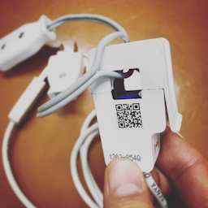

emeter8870-read.rb
====
sample secript for USB e-Meter 8870

USB e-Meter 8870
----

  - http://akizukidenshi.com/catalog/g/gM-07017/
  - http://www.aviosys.com/8870.html
  - http://www.aviosys.com/downloads/manuals/others/USB%20e-Meter8870Manual_EN.pdf

How to use
----

    $ mkdir -p ~/work/  
    $ cd ~/work/
    $ git clone https://github.com/yoggy/emeter8870-read
    $ cd emeter8870
    $ sudo apt-get install redis ruby ruby-dev
    $ sudo gem install serialport redis mqtt
    $ ./emeter8870-read.rb

Copyright and license
----

Copyright (c) 2017 yoggy

Released under the [MIT license](LICENSE.txt)
